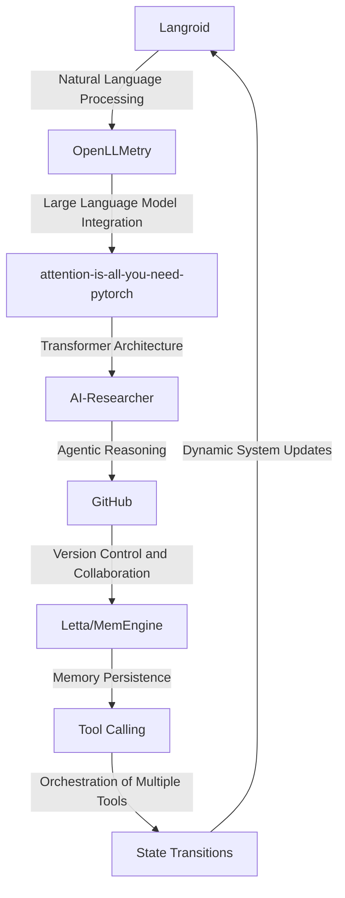

# Electrochemical Risk Navigator
> Orchestrating a symphony of artificial intelligence, machine learning, and domain expertise to navigate the labyrinthine complexities of electrochemical risk in the carbon, electric, and manufacturing industries.

## 🏗️ Technical Architecture & Multi-Agent Flow

This intricate dance of technologies enables the Electrochemical Risk Navigator to harness the power of artificial intelligence, machine learning, and human expertise to mitigate risks in the carbon, electric, and manufacturing industries.

## 🔍 The Vertical Bottleneck: Electrochemical Risk
The carbon, electric, and manufacturing industries are beset by a myriad of electrochemical risks that can have far-reaching consequences, including equipment damage, production disruptions, and environmental hazards. The complexities of electrochemical reactions, coupled with the variability of materials and operating conditions, create a perfect storm of uncertainty that can be daunting to navigate. Traditional risk assessment methods often rely on simplistic models that fail to capture the nuances of these complex systems, leading to inadequate mitigation strategies and increased exposure to risk.

The high-stakes nature of these risks demands a more sophisticated approach, one that can account for the intricate interplay of factors that contribute to electrochemical risk. This is where the Electrochemical Risk Navigator comes into play, leveraging cutting-edge technologies to provide a more comprehensive and accurate assessment of risk.

The vertical bottleneck in this context refers to the challenges of integrating multiple technologies and expertise to create a seamless and effective risk navigation system. This requires a deep understanding of the underlying electrochemical processes, as well as the ability to harness the power of artificial intelligence and machine learning to analyze complex data sets and identify potential risks.

## 🔍 The Vertical Bottleneck: Technical Friction
Technical friction is a significant obstacle in the development of effective electrochemical risk navigation systems. This friction arises from the difficulties of integrating multiple technologies, including natural language processing, large language models, transformer architectures, and agentic reasoning. The lack of standardization and interoperability between these technologies can create significant barriers to implementation, making it challenging to develop a cohesive and effective system.

Furthermore, the high-stakes nature of electrochemical risk demands a system that can operate with a high degree of accuracy and reliability. This requires a deep understanding of the underlying electrochemical processes, as well as the ability to harness the power of artificial intelligence and machine learning to analyze complex data sets and identify potential risks.

## 🔍 The Vertical Bottleneck: Operational Failures
Operational failures are a significant concern in the carbon, electric, and manufacturing industries, where electrochemical risks can have far-reaching consequences. These failures can arise from a variety of sources, including equipment malfunctions, human error, and inadequate risk assessment. The consequences of these failures can be severe, resulting in production disruptions, environmental hazards, and significant economic losses.

The Electrochemical Risk Navigator is designed to mitigate these risks by providing a comprehensive and accurate assessment of electrochemical risk. By leveraging cutting-edge technologies, including artificial intelligence, machine learning, and natural language processing, the system can analyze complex data sets and identify potential risks, enabling proactive measures to be taken to prevent operational failures.

## 💡 The Solution: Electrochemical Risk Navigator
The Electrochemical Risk Navigator is a revolutionary platform that orchestrates the power of Langroid, OpenLLMetry, attention-is-all-you-need-pytorch, AI-Researcher, and GitHub to provide a comprehensive and accurate assessment of electrochemical risk. By leveraging the strengths of each technology, the system can analyze complex data sets, identify potential risks, and provide proactive measures to mitigate these risks.

The Electrochemical Risk Navigator is designed to operate with a high degree of accuracy and reliability, using agentic reasoning and memory persistence to ensure that the system can learn from experience and adapt to changing conditions. The platform also integrates with GitHub, enabling seamless collaboration and version control.

## 🧩 Agentic Stack Deep-Dive
The agentic stack is a critical component of the Electrochemical Risk Navigator, enabling the system to analyze complex data sets and identify potential risks. The stack consists of multiple layers, each with its own unique functionality and contribution to the overall system.

Langroid provides natural language processing capabilities, enabling the system to analyze and understand complex text-based data. OpenLLMetry integrates large language models, providing the system with the ability to analyze and generate human-like text. attention-is-all-you-need-pytorch provides a transformer architecture, enabling the system to analyze complex sequences of data. AI-Researcher provides agentic reasoning, enabling the system to make decisions and take proactive measures to mitigate risks. GitHub provides version control and collaboration, enabling seamless integration and development of the system.

## ✨ Capabilities & Features
* **Electrochemical Risk Assessment**: The Electrochemical Risk Navigator provides a comprehensive and accurate assessment of electrochemical risk, enabling proactive measures to be taken to mitigate these risks.
* **Natural Language Processing**: The system uses natural language processing to analyze complex text-based data, enabling the identification of potential risks and the development of effective mitigation strategies.
* **Large Language Model Integration**: The system integrates large language models, providing the ability to analyze and generate human-like text, and enabling the development of more effective risk assessment and mitigation strategies.
* **Transformer Architecture**: The system uses a transformer architecture, enabling the analysis of complex sequences of data, and providing a more comprehensive understanding of electrochemical risk.
* **Agentic Reasoning**: The system uses agentic reasoning, enabling the system to make decisions and take proactive measures to mitigate risks, and providing a more effective and efficient risk navigation system.
* **Memory Persistence**: The system uses memory persistence, enabling the system to learn from experience and adapt to changing conditions, and providing a more effective and efficient risk navigation system.
* **GitHub Integration**: The system integrates with GitHub, enabling seamless collaboration and version control, and providing a more effective and efficient development process.
* **Real-Time Monitoring**: The system provides real-time monitoring, enabling the identification of potential risks and the development of effective mitigation strategies.
* **Predictive Analytics**: The system uses predictive analytics, enabling the identification of potential risks and the development of effective mitigation strategies.
* **Collaboration Tools**: The system provides collaboration tools, enabling seamless integration and development of the system, and providing a more effective and efficient development process.

## 🛠️ Technical Implementation
The Electrochemical Risk Navigator is implemented using a combination of Python, PyTorch, and GitHub. The system consists of multiple modules, each with its own unique functionality and contribution to the overall system.

The natural language processing module uses Langroid to analyze complex text-based data, and identify potential risks. The large language model integration module uses OpenLLMetry to integrate large language models, and provide the ability to analyze and generate human-like text. The transformer architecture module uses attention-is-all-you-need-pytorch to analyze complex sequences of data, and provide a more comprehensive understanding of electrochemical risk.

The agentic reasoning module uses AI-Researcher to make decisions and take proactive measures to mitigate risks, and provide a more effective and efficient risk navigation system. The memory persistence module uses Letta/MemEngine to enable the system to learn from experience and adapt to changing conditions.

## 📊 Business Impact & ROI
The Electrochemical Risk Navigator has the potential to significantly impact the carbon, electric, and manufacturing industries, by providing a comprehensive and accurate assessment of electrochemical risk. By leveraging cutting-edge technologies, including artificial intelligence, machine learning, and natural language processing, the system can analyze complex data sets, identify potential risks, and provide proactive measures to mitigate these risks.

The system can help companies to reduce the risk of operational failures, and minimize the consequences of these failures. The system can also help companies to improve their overall efficiency and productivity, by providing a more effective and efficient risk navigation system.

The return on investment (ROI) for the Electrochemical Risk Navigator is significant, as the system can help companies to reduce costs associated with operational failures, and improve their overall efficiency and productivity. The system can also help companies to improve their reputation and credibility, by demonstrating a commitment to safety and risk management.

## 🚀 Getting Started
```bash
git clone https://github.com/arvind-sundararajan/carbon-electric-manufacturing-risk.git
cd carbon-electric-manufacturing-risk
pip install -r requirements.txt
python src/main.py
```

## 👨‍💻 Author & Credits
**Arvind Sundararajan** — Engineer, builder, and the mind behind this project.
🌐 [LinkedIn](https://www.linkedin.com/in/arvind-sundara-rajan/) | Chennai, India

---
### 🙏 Acknowledgements
- The open-source community
- The Carbons, electric, manufacturing practitioners who inspired this design

The development of the Electrochemical Risk Navigator would not have been possible without the contributions of the open-source community, and the inspiration of the Carbons, electric, manufacturing practitioners who shared their expertise and knowledge. The system is a testament to the power of collaboration and innovation, and demonstrates the potential for cutting-edge technologies to drive positive change in the world.